# Writing Week 1
## Unix Command Line

- ### Command Line Interface (CLI)

    Dengan menggunakan CLI user dapat mengetikkan sebuah perintah dalam bentuk teks dan memberikan instruksi pada komputer untuk mengerjakan tugas tertentu.

- ### Shell

    Pada Command Line terdapat aplikasi bernama Shell. Shell adalah perintah-perintah yang digunakan untuk menginstruksikan ke sistem operasi. Ada banyak model Shell, kalau di **Linux** itu nama Shellnya yaitu **Bash**, kalau di **Windows** namanya **PowerShell**. Untuk mengakses Shell bisa menggunakan file explorer, terminal, dan cmd.

- ### Cara mengakses CLI dan menggunakan terminal

    Bagaimana kita akan berinteraksi menggunakan Command Line Interface? Semua perintah-perintah akan dilakukan melalui aplikasi yang disebut terminal. Terminal merupakan tempat/aplikasi dimana user dapat mengetikan atau memberikan suatu perintah. Disinilah tempat dimana shell akan berperan.

- ### File System Structure

     Sistem operasi menggunakan sesuatu yang disebut **File System**. File system mengatur bagaimana data disimpan dalam sebuah system. Sistem operasi Windows & Unix-like menyusun file dan direktori menggunakan struktur yang bentuknya mirip tree. Sebuah direktori bisa memiliki file dan bisa memiliki sub direktori, dan sebuah sub direktori bisa memiliki sub direktori lagi. Dalam sebuah file sistem tree direktori yang paling atas biasanya disebut **Root Directory**.

    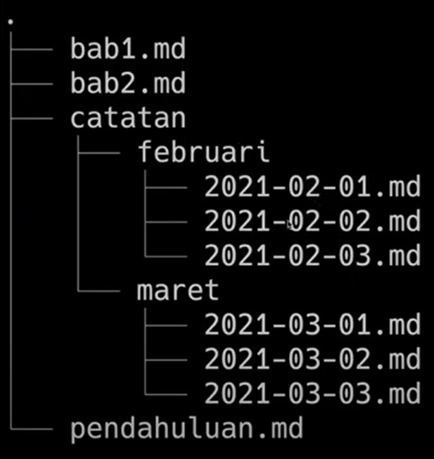

- ### Command

    - **pwd** (print working directory) -> untuk melihat current working directory
    - **dir** (directory) -> untuk melihat directory
    - **cd** (change directory) -> untuk pindah directory
    - **ls** (list) -> untuk melihat isi file di dalam directory
    - **touch** -> untuk membuat file directory
    - **cp** (copy) -> untuk menyalin file directory
    - **mv** (move) -> untuk memindahkan file directory
    - **rm** (remove) -> untuk menghapus file directory

## GIT & GITHUB

- ### GIT
    Git merupakan software berbasis Version Control System (VCS) yang bertugas untuk mencatat perubahan seluruh file atau repository suatu project. Developer software biasa menggunakan Git untuk distributed revision (VCS terdistribusi), hal ini bertujuan untuk menyimpan database tidak hanya ke satu tempat. Namun semua orang yang terlibat dalam penyusunan kode dapat menyimpan database ini.

- ### GITHUB
    GitHub merupakan layanan cloud yang berguna untuk menyimpan dan mengelola sebuah project yang dinamakan repository (repo git). Cara kerja pada GitHub harus terkoneksi pada internet sehingga tidak perlu meng-install sebuah software ke dalam perangkat keras. Hal ini memberikan keringanan penyimpanan komputer yang kita gunakan karena file project tersimpan oleh cloud GitHub.

- ### Perbedaan GIT & GITHUB
    Perbedaan antara Git dan GitHub sangat unik dan memiliki keunggulan masing-masing. Berikut ini perbedaan dari kedua platform tersebut.

    | Git | GitHub |
    | ---  | ---   |
    | 1. Menginstall _software_ di penyimpanan lokal | 1. _Host_ melalui layanan _cloud_ |
    | 2. Dikelola oleh The Linux Foundation | 2. Diakuisisi oleh Microsoft pada 2018 |
    | 3. Berfokus pada _version control_ dan _code sharing_ | 3. Berfokus pada _source code hosting_ terpusat |
    | 4. Akses secara _offline_ | 4. Akses secara _online_ |
    | 5. Tidak menggunakan fitur _user management_ | 5. menggunakan _user management_ |
    | 6. Menyediakan _desktop interface_ bernama "Git GUI" | 6. Menggunakan nama _desktop interface_ "GitHub Desktop" |

- ### Kenapa GIT & GITHUB Tools wajib digunakan?
    Dengan menggunakan GIT dan Github, kita akan bisa bekerja dalam sebuah tim. **Tujuan besarnya** yaitu kita bisa **berkolaborasi** mengerjakan proyek yang sama tanpa harus repot _copy paste_ folder aplikasi yang terupdate.

    Kita juga **tidak perlu menunggu** teman dalam satu tim menyelesaikan suatu program dahulu untuk berkolaborasi. Kita bisa membuat file di dalam proyek yang sama atau membuat code di file yang sama dan menyatukannya saat sudah selesai.

- ### Alur Kerja GIT dan GITHUB
    - Setup Awal

        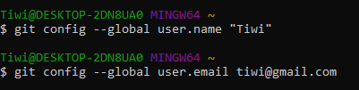

    - Cek apakah setup berhasil

        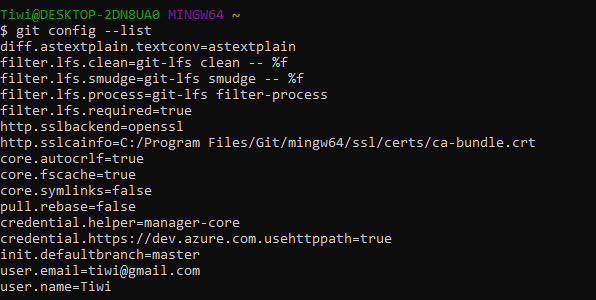
- ### Membuat Repository GIT
    - Membuat repository menggunakan git init <nama_proyek>

        

    - Melacak perubahan menggunakan git status

        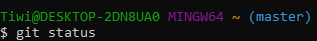
- ### Commit pada GIT
    - git commit, untuk melakukan commit atau menyimpan perubahan pada version control pada git. Dan kita bisa menambahkan pesan untuk membeikan checkout pada setiap perbuahan. Contoh seperti gambar di bawah ini.

        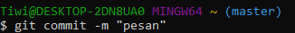
- ### Publish Aplikasi ke GITHUB
    - git push origin, untuk mempublish file atau aplikasi ke github.

        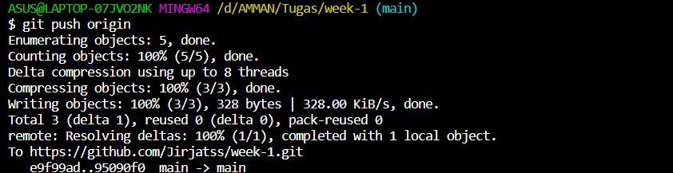
- ### Cloning GITHUB ke Local
    - git clone, untuk melakukan cloning dari github ke komputer atau local

        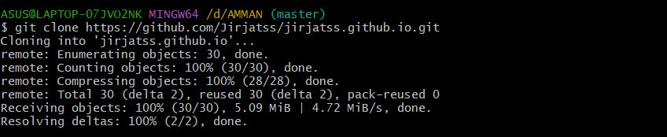

## HTML (Hyper Text Markup Language)

- ### Apa itu HTML dan bagaimana cara kerjanya?
    HTML adalah sebuah bahasa yang menggunakan markup atau penanda untuk membuat halaman web. Penanda atau markup ini disebut dengan tag. HTML berperan untuk menentukan struktur konten dan tampilan dari sebuah web.

    File HTML diakhiri dengan ekstensi .html atau .htm. Ekstensi file ini bisa dilihat dengan mengunakan web browser apa pun (seperti Google Chrome, Safari, atau Mozila Firefox). Browser tersebut membaca file HTML dan merender kontennya sehingga user internet bisa melihat dan membacanya.
- ### Struktur HTML
    Secara garis besar, struktur dokumen HTML dapat digambarkan sebagai berikut:
     ```bash
      <html>
        <head>
            <title>Page title</title>
        </head>
        <body>

            <h1>This is a heading</h1>
            <p>This is a paragraph.</p>
            <p>This is another paragraph.</p>
            
        </body>
      </html>
    ```

    Dokumen HTML memiliki 3 tag utama, yaitu ```<html>,<head>,``` dan ```<body>```. Ketiga tag tersebut harus diketik persis seperti contoh di bawah ini:

    ```bash
    <!DOCTYPE html>
    <html>
        <head>
            ...
        </head>
        <body>
            ...
        </body>
    </html>
    ```
    Penjelasan dari contoh di atas:
    - ```<!DOCTYPE>``` syntax mendefinisikan versi dari HTML yang digunakan dan harus dideklarasi sebelum tag ```<html>```. ```<!DOCTYPE html>``` mendefinisikan bahwa dokumen ini adalah HTML5.
    - ```<html></html>``` adalah root element dari halaman HTML. Semua HTML tag lainnya harus dibungkus dengan tag ini.
    - ```<head>``` pada umumnya berisi ```<meta>```, ```<title>```, konten css/js internal maupun link ke file css/js eksternal.
    - ```<body>``` berisi konten website yang ingin ditampilkan pada browser.

- ### Heading
    Tag heading akan menampilkan struktur website kita. Bisa diumpamakan seperti tag ```<h1>``` sebagai judul bab, kemudian ```<h2>``` sebagai judul sub bab.
    Tag heading hanya memiliki **6 tingkatan**. Penulisannya seperti berikut:
    ```bash
    <h1>Heading Satu</h1>
    <h2>Heading Dua</h2>
    <h3>Heading Tiga</h3>
    <h4>Heading Empat</h4>
    <h5>Heading Lima</h5>
    <h6>Heading Enam</h6>
    ```

    Hasil di browser akan seperti di bawah ini:

    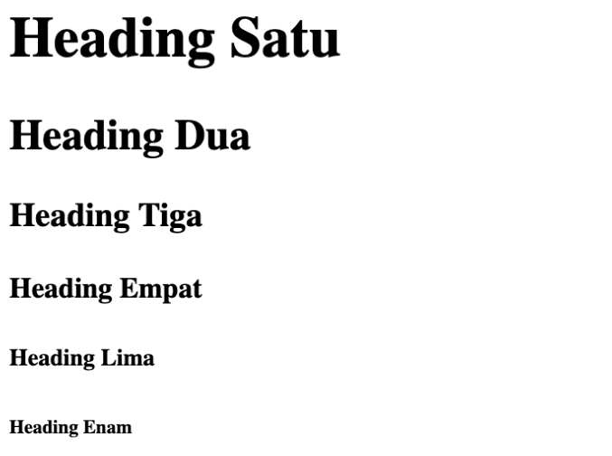

- ### Paragraf
    Untuk membuat paragraf pada halaman website, maka dibutuhkan tag ```<p>```.
    Penulisannya seperti berikut:
    ```bash
    <p>
        Ini adalah paragraf. Ini adalah paragraf. Ini adalah paragraf. Ini adalah paragraf. Ini adalah paragraf. Ini adalah paragraf. Ini adalah paragraf. Ini adalah paragraf. Ini adalah paragraf.
    </p>
    ```

    Hasil di browser akan seperti di bawah ini:

    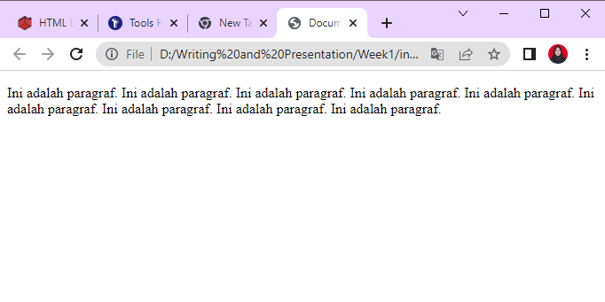
    
- ### Link/Anchor
    Terkadang, kita membutuhkan halaman web yang kita buat bisa mengakses halaman web lain. Maka dari itu, kita butuh membuat link.

    Untuk membuat link pada halaman web, maka diperlukan tag ```<a>```. Tag ```<a>``` memiliki attribute href yang berguna untuk menyimpan link website yang dituju.

    Penggunannya seperti ini:
    ```bash
    <a href="https://google.com">Google</a>
    ```
- ### Span
    Tag ```<span>``` digunakan untuk mengelompokkan tulisan dalam satu baris. Pada umumnya sering digunakan untuk menambahkan CSS pada suatu tulisan pada satu baris, tapi tidak menutup kemungkinan digunakan untuk hal lainnya.

    Contoh penggunaan:
    ```bash
    <p>Bunga Matahari berwarna <span style="color:yellow"> kuning</span></p>
    ```

    Hasil di browser akan seperti di bawah ini:

    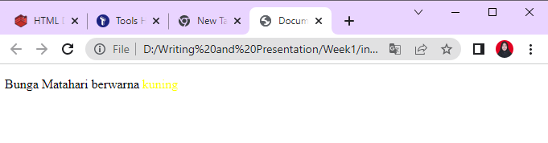
- ### Huruf Tebal
    Tag ```<b>``` atau ```<strong>``` digunakan untuk membuat tulisan menjadi tebal.

    Contoh penggunaan:
    ```bash
    <p>
        Nama saya <b>Tiwi</b>. Saya berumur <strong>21 tahun.</strong>
    </p>
    ```
    Contoh di atas akan terlihat di browser seperti ini:

    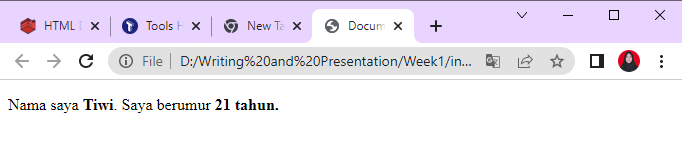
- ### Gambar
    Untuk menampilkan gambar pada halaman sebuah website, maka kita membutuhkan tag .

    Contoh penggunaannya:
    ```bash
    
    ```
    
    Attribute alt memberikan informasi alternatif atas gambar jika pengguna tidak bisa melihat gambar di website kita. Attribute alt harus mendeskripsikan tentang gambar yang bersangkutan jika gambar tersebut berisi informasi.
    
    Hasil dari kode di atas pada browser akan terlihat seperti ini:

    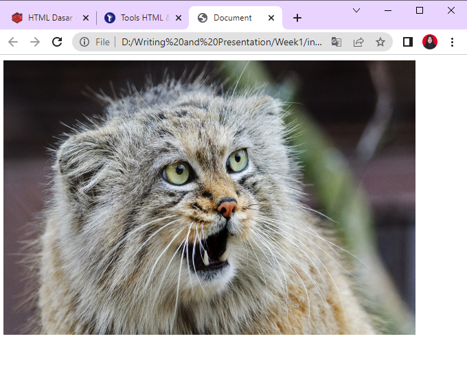
- ### Deploy HTML
    Deploy adalah sebuah proses untuk menyebarkan aplikasi yang sudah kita kerjakan supaya bisa digunakan oleh orang-orang. Jika aplikasi kita HTML atau Web App kita perlu mendeploy ke server. Untuk melakukan hal tersebut kita bisa menggunakan layanan yang bernama Netlify

## CSS (Cascading Style Sheet)

- ### Peran CSS pada web development
    CSS adalah bahasa komputer yang digunakan untuk menambahkan design ke suatu halaman website. Fungsi CSS adalah sebagai **'baju'** atau **'dekorator'** dari sebuah website.

- ### Cara menyisipkan CSS ke dalam HTML
    Ada 3 cara untuk menyisipkan CSS ke dalam HTML, yaitu:
    - **Inline CSS**, yaitu menggunakan attribute style untuk menyisipkan kode CSS langsung di dalam HTML element.

        Contoh:
        ```bash
        <!DOCTYPE html>
        <html>
        <head>
            <title>
            Website Pertamaku
            </title>
        </head>
        <body>
            <h1 style="color:blue;">Hello World!!</h1>
        </body>
        </html>
        ```

        Hasilnya:

        

    - **Internal CSS**, yaitu menggunakan element ```<style>``` untuk menyisipkan kode CSS. Element ```<style>``` tersebut diletakkan di dalam element .

        Contoh:
        ```bash
        <!DOCTYPE html>
        <html>
        <head>
            <title>Belajar CSS</title>
            <style>
            body {
                background-color: green;
            }
            h1 {
                color: yellow;
            }
            p {
                color: pink;
            }
            </style>
        </head>
        <body>
            <h1>Belajar CSS</h1>
            <p>Hello World!!</p>
        </body>
        </html>
        ```

        Hasilnya:

        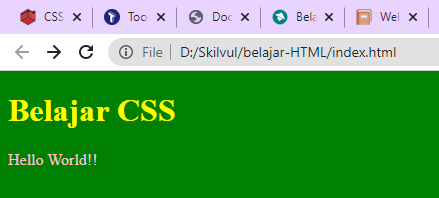

    - **External CSS**, yaitu sebuah file CSS terpisah yang disambungkan dengan file HTML dengan menggunakan element ```<link>```.
        Contoh:
        ```bash
        <!-- File index.html -->
        <!DOCTYPE html>
        <html>
        <head>
            <title>Belajar CSS</title>
            <link rel="stylesheet" href="styles.css" />
        </head>
        <body>
            <h1>Belajar CSS</h1>
            <p>Hello World!!</p>
        </body>
        </html>

        /* File styles.css */
        body {
        background-color: pink;
        }
        h1 {
        color: green;
        }
        p {
        color: blue;
        }
        ```

        Hasilnya:

        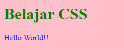

- ### CSS Syntax
    CSS Syntax adalah syntax yang digunakan untuk menunjuk atau memilih HTML element mana yang ingin diberi style (dihias). CSS syntax terdiri dari selector, property, dan value.

    Syntaxnya seperti ini:
    ```bash
    selector {
    property: value;
    }
    ```

    Contoh:
    
    Misalnya kita memiliki element paragraf ```<p>``` yang ingin kita ubah menjadi warna biru. Caranya seperti di bawah ini:
    ```bash
    <!-- Pada file HTML -->
    <p>Hello world</p>

    /* Pada file CSS */
    p {
    color: blue;
    }
    ```
    
- ### Metode responsive web design menggunakan CSS

    - **Mengatur Viewport**
        
        Secara umum viewport adalah daerah pada layar yang menampilkan suatu konten.
    - **Menggunakan Persentase untuk Menentukan Nilai Lebar Suatu Element**
        
        Kita bisa menggunakan persentase untuk menentukan lebar suatu element agar sama dengan lebar parent element-nya.
    - **Properti 'max-width: 100%'**
        
        Kita bisa menggunakan properti ```max-width: 100%``` untuk menentukan lebar maksimal dari suatu element.

    - **Satuan Unit "vw"**

        Suatu teks bisa diatur ukurannya dengan menggunakan vw, yang artinya viewport width. Viewport adalah ukuran lebar window browser.
        
        Catatan:
        1vw = 1% lebar viewport

        Jika lebar viewport sebesar 100cm, maka 1vw adalah 1cm

    - **Media Query**
        
        Dengan menggunakan media query, kita bisa mengatur lebar suatu element dan/atau memberikan style lain yang berbeda-beda sesuai dengan ukuran dari browser.

    - **Flexbox Element**
        
        Flexbox memudahkan para programmer untuk mengatur layout, posisi, dan ukuran dari tiap element di dalamnya.

        Ada dua istilah penting saat belajar flexbox:

        - **container** adalah element yang membungkus dan mengatur tampilan dari element di dalamnya,
        - **item** adalah element dalam container yang diatur tampilannya.


## JavaScript Dasar
Fungsi JavaScript, sebagai element yang membuat website menjadi **interaktif**.

Sebelum mulai masuk mempelajari JavaScript lebih dalam, ada baiknya kita mempelajari dahulu bagaimana cara menyisipkan JavaScript di dalam HTML. Hal ini ditujukan agar kode JavaScript kita bisa dibaca oleh browser, dan bisa berinteraksi dengan kode HTML kita.

Ada dua cara, yaitu:

- **Internal JavaScript**, yaitu menyisipkan kode JavaScript langsung di dalam file HTML.
- **External JavaScript**, yaitu membuat file JavaScript sendiri dan menyambungkannya dengan file HTML.

- ### Internal JavaScript
    Untuk menyisipkan kode JavaScript di dalam file HTML, kita bisa menuliskan kode JavaScript di dalam tag ```<script>```. Tag ```<script>``` sendiri bisa ditulis di dalam ```<head>``` maupun di dalam bagian akhir dari ```<body>```.

    Contoh:
    ```bash
    <!-- <script> tag di dalam <head> -->

    <!DOCTYPE html>
    <html>
    <head>
        <title>Website Pertamaku</title>
        <script>
        console.log("Halo Semua!"); // output : Halo Semua!
        </script>
    </head>
    <body>
        <h2>JavaScript di dalam head</h2>
    </body>
    </html>
    <!-- <script> tag di dalam <body> -->

    <!DOCTYPE html>
    <html>
    <head>
        <title>Website Pertamaku</title>
    </head>
    <body>
        <h2>JavaScript di dalam body</h2>

        <script>
        console.log("Halo Semua!"); // output : Halo Semua!
        </script>
    </body>
    </html>
    ```

- ### Eksternal JavaScript
    Eksternal JavaScript yaitu membuat file JavaScript yang terpisah dengan file HTML.

    Cara menyambungkannya sama seperti internal JavaScript, yaitu menggunakan tag ```<script>``` di dalam element ```<body>```, hanya saja, kita menambahkan attribute src di dalam ```<script>``` untuk menyambungkan dengan file eksternal JavaScript kita.

    Contoh:

    Kita akan membuat dua buah file yaitu ```script.js``` dan ```index.html```.

    Pada file HTML, kita akan sambungkan file JavaScript menggunakan element ```<script>```, seperti ini:
    ```bash
    <!-- File index.html -->

    <!DOCTYPE html>
    <html>
    <head>
        <title>Website Pertamaku</title>
        <script src="script.js"></script>
    </head>
    <body>
        <h2>Hello, World!</h2>
    </body>
    </html>

    // File script.js

    console.log("Halo Semua!"); // output : Halo Semua!
    ```

    Sama seperti internal JavaScript, hasil dari cara ini jika dibuka di console akan menghasikan tulisan "Halo Semua!"

- ### Tipe Data dalam JavaScript
    - string - deretan karakter yang diapit oleh sepasang tanda kutip;
    - **number** - bilangan bulat, pecahan, dan lain-lain;
    - **boolean** - nilai benar dari sebuah pernyataan yang dituliskan sebagai true atau false;
    - **null** - sebuah nilai yang berarti kosong atau menunjuk pada nilai yang tidak ada;
    - **undefined** - berbeda dari null, undefined menandakan kondisi variabel yang belum diberi sebuah nilai. Jadi pernyataan "nilai variabel itu adalah undefined" sebenarnya kurang tepat, sebab variabelnya memang tidak mempunyai sebuah nilai;
    - **symbol** - sebuah nilai unik yang dihasilkan tiap kali kita memanggil fungsi Symbol(). Nilai unik ini memiliki beberapa kegunaan seperti memberi nomor identifikasi unik dan berperan sebagai nama properti unik sebuah objek;
    - **object** - sebuah kumpulan pasangan properti dan nilai. Seperti objek dalam kehidupan sehari-hari saja. Misalnya objek Apel memiliki properti warna dengan nilai merah.

## Algoritma dan Data Structures
Sebelum kita memperdalam pengetahuan kita mengenai tipe-tipe algoritma dan data structure, mari kita mengenal terlebih dahulu secara singkat apa itu algorithm dan data structures.

- **Algorithm** mengacu pada step-by-step procedure untuk memecahkan masalah yang diberikan dengan cara yang paling efektif.

- Sementara **data structures** adalah konsep abstrak yang membentuk dan mengatur data agar data di dalam komputer dapat diakses dan diperbarui secara efisien.

- ###  Apa itu Algoritma
    - Algoritma adalah sekumpulan instruksi untuk melakukan sesuatu.
    - Suatu algoritma harus memiliki urutan perhitungan dan tugas yang masuk akal untuk memecahkan masalah, bukan hanya sekumpulan perintah.
    - Kita dapat merencanakan untuk membuat algoritma, yang merupakan prosedur yang terdiri dari perintah untuk pemecahan masalah. Proses perencanaan algoritma dapat dibuat dengan pseudocode dan flowchart.

- ### Ciri-Ciri Algoritma
    - Memiliki input
    - Memiliki output
    - Memiliki instruksi yang jelas/tidak ambigu
    - Memiliki titik berhenti
    - Tepat sasaran dan efisien

- ### Jenis Proses dalam Algoritma
    - Sequence 
        urut/runut (menyelesaikan masalah line by line)

        Contoh:
        ```bash
        let a = 2;
        let b = 5;
        let c = 0;
        c = a + b;

        Console.log(c)
        ```
    - Selection
        Percabangan (jika ... maka ...) 

        Contoh:
        ```bash
        if (2 < 10) {
            display ("Benar")
        }else{
            display ("Salah") //output: "Benar"
        }
        ```
    - Repetition/ Loop
        Perulangan. Dalam algoritma terdapat 3 jenis repetition yaitu for, while ... do, do ... while.

        - For yaitu perulangan yang fix
        - While ... do yaitu perulangan by condition. Perulangan yang dilakukan ketika ada suatu kondisi. Dilakukan disaat kita melakukan pencarian.
        - do ... while yaitu perulangan yang akan menjalankan dulu baru akan dicek kondisinya.

- ### Pseudocode
    - Pseudocode merupakan representasi dari suatu algoritma yang menggunakan bahasa sehari-hari. Pseudocode bisa menjadi awal yang baik untuk mengembangkan algoritma ketika Anda tidak memiliki pengetahuan latar belakang yang cukup tentang pemrograman.
    - Pseudocode berperan sebagai jembatan untuk melengkapi flowchart dan kode yang sebenarnya. Ini sering digunakan oleh programmer sebagai pedoman dasar ketika mereka mengimplementasikan kode yang sebenarnya.

- ### Flowchart
    - Flowchart mengungkapkan perintah dengan beberapa bentuk standar dan alur kerja menggunakan panah.
    - Untuk bentuk dan simbol, menggunakan standar yang ditetapkan oleh Organisasi Internasional untuk Standardisasi (ISO).
    - Penting untuk menggambar flowchart dari atas ke bawah dan dari kiri ke kanan tanpa saling tumpang tindih.