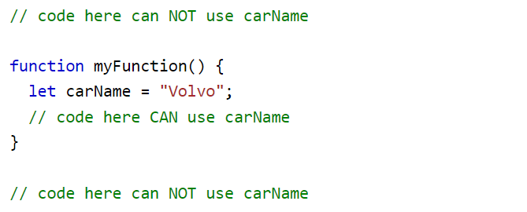

# Writing Week 1
## JavaScript Dasar - Scope
Scope adalah konsep dalam flow data variabel.

JavaScript memiliki 3 jenis scope:
- ### Block scope
    Blocks adalah code yang berada di dalam curly braces {}. Conditional, function, dan looping menggunakan blocks.

    ES6 memperkenalkan dua keywords JavaScript baru: ```let``` dan ```const```. Dua keywords ini menyediakan block scope dalam JavaScript. Variabel yang dideklarasikan di dalam block {} tidak dapat diakses dari luar block.

    Contoh:

    

    Variabel yang dideklarasikan dengan keyword ```var``` **tidak** boleh memiliki cakupan block.

    Variabel yang dideklarasikan di dalam block {} dapat diakses dari luar block.

    Contoh:

    

- ### Local scope
    Local scope berarti kita mendeklarasikan variabel di dalam blocks seperti function, conditional, dan looping. Maka variabel hanya bisa diakses di dalam blocks saja. Tidak bisa diakses di luar blocks.

    Contoh:

    

    Local variabel memiliki Function scope. Mereka hanya dapat diakses dari dalam fungsi. Karena local variable hanya dikenali di dalam funsinya, variabel dengan nama yang sama dapat digunakan dalam fungsi yang berbeda. Local variable dibuat saat fungsi dimulai, dan dihapus saat fungsi selesai.

    JavaScript memiliki function scope: Setiap fungsi membuat scope baru. Variabel yang didefinisikan di dalam suatu fungsi tidak dapat diakses (terlihat) dari luar fungsi.

    Variabel yang dideklarasikan dengan ```var```, ```let```, dan ```const``` sangat mirip ketika dideklarasikan di dalam suatu fungsi.

    Mereka semua memiliki Function scope:

    

    

    

- ### Global scope
    Variabel yang dideklarasikan secara global (di luar fungsi apapun) memiliki **Global Scope**.

    Global variables dapat diakses dari mana saja dalam program JavaScript. Agar menjadi Global Scope, suatu variabel harus dideklarasikan di luar block.

    Variabel yang dideklarasikan dengan ```var```, ```let```, dan ```const``` sangat mirip ketika dideklarasikan di luar block.

    Contoh:
    ```bash
    var x = 2;          // Global scope

    let x = 2;          // Global scope

    const x = 2;        // Global scope
    ```
## JavaScript Dasar - Function
Function adalah sebuah blok kode dalam sebuah grup untuk menyelesaikan 1 task/1 fitur.

- ### Syntax Fungsi JavaScript
    Fungsi JavaScript didefinisikan dengan keyword ```function```, diikuti dengan **nama fungsi**, diikuti dengan tanda kurung **()**.

    Nama fungsi dapat berisi huruf, angka, garis bawah, dan tanda dollar (sama dengan variabel).

    Tanda kurung dapat menyertakan nama parameter yang dipisahkan dengan koma: **(parameter1, parameter2, ...)**

    Kode yang akan dieksekusi oleh fungsi, ditempatkan di dalam tanda kurung kurawal **{}**.

    Contoh:
    ```bash
    function name(parameter1, parameter2, parameter3) {
        // kode yang akan dieksekusi
    }
    ```

    **Parameter** fungsi tercantum di dalam tanda kurung () dalam definisi fungsi.

    **Argumen** fungsi adalah **nilai** yang diterima oleh fungsi saat dipanggil.

- ### Pengembalian Fungsi
    Ketika JavaScript mencapai ```return``` statement, fungsi akan berhenti dijalankan.

    Fungsi sering menghitung **return value**. Nilai pengembalian "dikembalikan" kembali ke "pemanggil".

    Contoh:
    ```bash
    // Hitung produk dari dua angka, dan kembalikan hasilnya:

    let x = myFunction(4, 3);   // Function is called, return value will end up in x

    function myFunction(a, b) {
    return a * b;             // Function returns the product of a and b
    }

    // Output 12
    ```

## Data Type Built in Prototype & Method
- ### Data Type
    JavaScript adalah bahasa dinamis dengan tipe dinamis. Variabel dalam JavaScript tidak secara langsung terkait dengan jenis nilai tertentu, dan variabel apa pun dapat diberi (dan ditetapkan ulang) nilai dari semua jenis.

    Contoh:
    ```bash
    let foo = 42; // foo is now a number
    foo = "bar"; // foo is now a string
    foo = true; // foo is now a boolean
    ```

- ### String
    String berguna untuk menyimpan data yang dapat direpresentasikan dalam bentuk teks. Beberapa operasi yang paling sering digunakan pada string adalah memeriksa ```length```, membangun dan menggabungkannya menggunakan operator string + dan +=, memeriksa lokasi substring dengan ```indexOf()``` method, atau mengekstrak substring dengan ```substring()``` method.

    Contoh:
    ```bash
    const string1 = "A string primitive";

    const string2 = 'Also a string primitive';

    const string3 = `Yet another string primitive`;

    const string4 = new String("A String object");
    ```

- ### Number
    Number adalah pembungkus object primitive yang digunakan untuk mewakili dan memanipulasi angka seperti 21 atau -9.75.

    Konstruktor Number berisi konstanta dan metode untuk bekerja dengan angka. Nilai jenis lain dapat dikonversi ke angka menggunakan ```Number()``` function.

    **Keterangan**
    Angka paling sering dinyatakan dalam bentuk literal seperti 0b101, 0o13, 0x0A. _Lexical grammar_ berisi referensi yang lebih rinci.

    ```bash
    123; // one-hundred twenty-three
    123.0; // same
    123 === 123.0; // true
    ```

    Angka literal seperti 37 dalam kode JavaScript adalah nilai floating-point, bukan integer. Tidak ada tipe integer terpisah dalam penggunaan sehari-hari yang umum. (JavaScript juga memiliki ```BigInt``` type, tetapi tidak dirancang untuk menggantikan Angka untuk penggunaan sehari-hari. 37 masih berupa angka, bukan BigInt.)

    Saat digunakan sebagai fungsi, Number(value) mengonversi string atau nilai lain ke tipe Angka. Jika nilainya tidak dapat dikonversi, ia akan mengembalikan ```NaN```.

    ```bash
    Number("123"); // returns the number 123
    Number("123") === 123; // true

    Number("unicorn"); // NaN
    Number(undefined); // NaN
    ```

- ### Math
    Math adalah built-in object yang memiliki properti dan metode untuk konstanta dan fungsi matematika. Ini bukan objek fungsi.

    Mathbekerja dengan ```Number``` tipe Ini tidak bekerja dengan ```BigInt```.

- ### Primitive & Non Primitive
    **Tipe data primitive**
    - Numbers
    - String
    - Boolean
    - Undefined
    - Null

    **Tipe data non-primitive**
    - Object
    - Array 
    - Function

    Kedua kategori mewakili dua cara berbeda tipe data ini disimpan ke dalam memori. Primitif disimpan berdasarkan **nilai** sedangkan Non-primitive (Object) disimpan dengan referensi.

    Mari kita lihat contoh bagaimana **Primitives** disimpan:
    ```bash
    let a = 5 
    let b = a 
    console.log(a) // 5 
    console.log(b) // 5 
    console.log(a === b) // true
    a = 10 
    console.log(a) // 10 
    console.log(b) // 5 
    console.log(a === b) // false
    ```

    Apa yang terjadi disini?

    Kami menetapkan dua variabel yang berbeda: **a** dan **b**.

    **a** ditetapkan sama dengan 5.

    **b** ditetapkan sama dengan **a**.

    Kemudian kita ubah nilai **a** menjadi sama dengan 10.

    Namun entah bagaimana, nilai **b** masih 5!

    Ini karena Primitif disimpan berdasarkan nilai.

    Artinya, setiap kali kita memutuskan untuk mendeklarasikan variabel baru menggunakan tipe data primitif, kita membuat alamat baru di memori untuk nilai tersebut.

    Sekarang mari kita lihat Non-Primitives (Objects) :
    ```bash
    let a = [10] 
    let b = a 
    console.log(a === b) // true
    a.push(10) 
    console.log(a) // [10, 10] 
    console.log(a === b) // true
    ```

    Kami menetapkan dua variabel yang berbeda: **a** dan **b**.

    **a** ditetapkan sama dengan array yang memiliki nilai tunggal: 10.

    **b** ditetapkan sama dengan **a**.

    Membandingkan **a** dan **b** menghasilkan **true**.

    Selanjutnya kami memodifikasi data di dalam **file**.

    Namun, membandingkan kedua variabel sekali lagi kami masih mengembalikan **true**.

    Alasan untuk ini adalah karena Non-Primitif (Objek) disimpan dengan referensi.

## HTML DOM
HTML DOM adalah model object standar dan antarmuka pemrograman untuk HTML.

- ### Proses rendering di balik layar
    HTML -> Parsing -> Tokens -> DOM
    CSS -> Parsing -> Tokens -> CSSOM
    DOM + CSSOM = Render Tree
    Layouting

    **Isu terkait proses rendering**. Jika saat proses parsing HTML ditemukan tag ```<script>```, secara default proses parsing akan dihentikan sampai script tersebut selesai diunduh dan dijalankan.

    **Solusi dari isu terkait proses rendering**.
    - Taruh tag ```<script>``` eksternal sebelum tag penutup ```</body>``` - ini solusi paling umum agar mulai diproses setelah parsing HTML selesai.
    - Taruh tag ```<script>``` sedini mungkin dan gunakan atribut async - atribut async akan membuat script tersebut diunduh tanpa menghentikan proses parsing dan dieksekusi selesainya ia diunduh.
    - Untuk script yang bergantung pada DOM, taruh tag ```<script>``` sedini mungkin, dan gunakan atribut defer - atribut defer akan membuat script tersebut diunduh tanpa menghentikan proses parsing dan dieksekusi seselesainya proses parsing selesai.

- ### Memanipulasi Element HTML
    Penting untuk diingat, bahwa DOM bukan bagian dari JavaScript, melainkan browser (API).

    - Mencari element HTML
    - Mengubah konten element
        - Element.textContent dapat kita gunakan untuk mnegubah teks di dalam sebuah element.
        - Element.innerHTML dapat kita gunakan untuk
        mengubah konten HTML di dalam sebuah element.
    - Membuat element HTML
        .createElement() -> .textContent untuk mengubah kontennya -> .appendChild() untuk menambahkan ke DOM

- ### Macam-macam HTML DOM Event
    - Focus
    - Change
    - Click
    - Hover
    - Blur
    - Scroll
    - Submit

- ### EventListener - Click
    Misalkan kita mempunyai element ```<input id=”user-input” />```  dan ```<button id=”alert-button”>```show```</button>```. 
    Kita ingin menampilkan pop up box yang berisi teks di dalam input tadi.

    ```bash
    // cari dulu kedua element tersebut berdasarkan id-nya

    const input = document.getElementById(“user-input”)
    const button = document.getElementById(“alert-button”)

    // baru tambahkan event listener
    button.addEventListener(“click”, function() {
        alert(input.value)
    })

    // atau
    button.onclick = function() { alert(input.value) }
    ```

- ### EventListener - Blur
    “Blur”, lawan dari “focus”, adalah event di mana sebuah element kehilangan fokus dari user (misal user klk mouse di luar element tersebut atau user klik tab untuk berpindah element)

    Misalkan kita ingin memvalidasi isi dari ```<input id=”username” />``` agar panjangnya minimal 6 karakter.

    ```bash
    // cari dulu element tersebut berdasarkan id-nya

    const input = document.getElementById(“username”)

    // tambahkan event listener
    input.addEventListener(“blur”, () => {
        if(input.value.length < 6) alert(“Panjang username minimal 6”)
    })

    ```

- ### EventListener - Form Submission
    Misalkan kita mempunyai element beberapa input dalam sebuah form ```<input name=”email />``` dan ```<input type=”password” name=”password” />```. Bagaimana caranya  kita mendapatkan isi dari kedua input tersebut saat submit form?

    Pasang event listener di form, lalu gunakan FormData untuk mengambil data dari masing-masing input.

    ```bash
    const form = document.getElementById(“form”)

    form.addEventListener(“submit”, function(event) {
        // cegah page refresh
        event.preventDefault()

        const formData = new FormData(form)
        const values = Object.fromEntries(formData) // { email: ... }
    })

    ```

