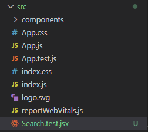
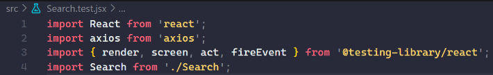
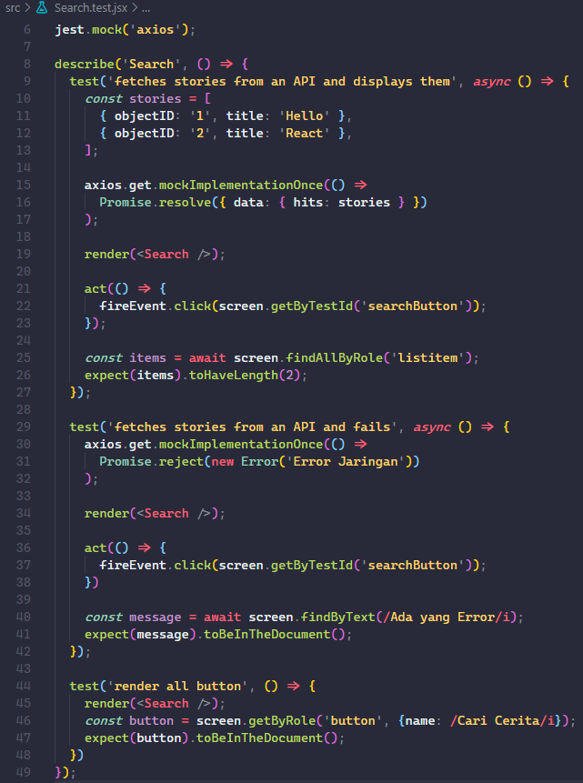
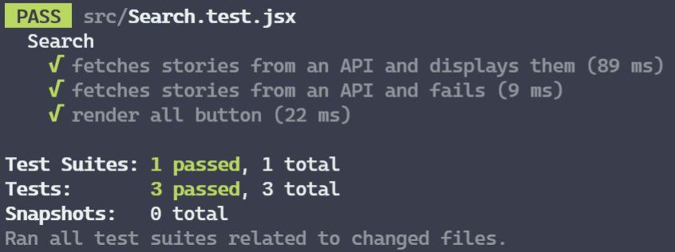

# Writing Week 3 Frontend Bootcamp
## React Context
Konteks memungkinkan melewatkan data melalui component tree tanpa melewatkan props secara manual di setiap level. Konteks menyediakan cara untuk meneruskan nilai antar komponen tanpa secara eksplisit melewatkan prop melalui setiap level component tree.

React Context API adalah struktur komponen, yang memungkinkan kita untuk berbagi data di semua level aplikasi. Tujuan utama dari API Konteks adalah untuk memecahkan masalah pengeboran prop (juga disebut “Threading”). API Konteks di React diberikan di bawah ini.

Context dirancang untuk berbagi data yang dapat dianggap “global” untuk diagram komponen React, seperti pengguna terotentikasi saat ini, tema, atau bahasa yang disukai. Misalnya, dalam kode di bawah ini kita secara manual memasang prop “theme” untuk memberi style pada komponen Button:
```bash
class App extends React.Component {
  render() {
    return <Toolbar theme="dark" />;
  }
}

function Toolbar(props) {
  // komponen Toolbar harus menggunakan *prop* "theme" tambahan
  // dan oper ke ThemedButton. Ini bisa menjadi *painful*
  // jika setiap tombol di dalam aplikasi perlu mengetahui *theme*-nya
  // karena itu harus melewati semua komponen.
  return (
    <div>
      <ThemedButton theme={props.theme} />
    </div>
  );
}

class ThemedButton extends React.Component {
  render() {
    return <Button theme={this.props.theme} />;
  }
}
```

Menggunakan context, kita dapat menghindari mengoper props melalui elemen perantara:

```bash
// Context memungkinkan kita untuk oper nilai ke dalam diagram komponen
// tanpa secara ekplisit memasukannya ke dalam setiap komponen.
// Buat *context* untuk tema saat ini (dengan "light" sebagai default).
const ThemeContext = React.createContext('light');

class App extends React.Component {
  render() {
    // Gunakan Provider untuk oper tema saat ini ke diagram di bawah ini.
    // Komponen apa pun dapat membacanya, tidak peduli seberapa dalam diagram tersebut.
    // Dalam contoh ini, kita mengoper "dark" sebagai nilai saat ini.
    return (
      <ThemeContext.Provider value="dark">
        <Toolbar />
      </ThemeContext.Provider>
    );
  }
}

// Komponen di tengah tidak harus 
// oper temanya secara ekplisit lagi.
function Toolbar() {
  return (
    <div>
      <ThemedButton />
    </div>
  );
}

class ThemedButton extends React.Component {
  // Tetapkan contextType untuk membaca *context theme* saat ini.
  // React akan menemukan Provider *theme* terdekat di atas dan menggunakan nilainya.
  // Dalam contoh ini, *theme* saat ini adalah "dark".
  static contextType = ThemeContext;
  render() {
    return <Button theme={this.context} />;
  }
}
```
### Apa itu context API?
Context API merupakan sebuah cara untuk membuat global state yang nanti bisa digunakan di semua level komponen tanpa harus mengirim props ke lower level component secara manual. Context API ini merupakan alternatif dari props drilling. Props drilling sendiri adalah cara mempassing props dari grandparent ke parent ke child ke grandchild dan seterusnya.

- ## Struktur awal
    App.js
    ```bash
    import React from "react";
    import "./styles.css";
    import CountContainer from "./components/CountContainer";
    import Count from "./components/Count";

    export default function App() {
        return (
            <div className="container">
            <CountContainer>
                <Count />
            </CountContainer>
            </div>
        );
        }
    ```

    Component/CountContainer.js
    ```bash
    import React from "react";
    import {useCountContext} from "../context"

    const CountContainer = ({ children }) => {
    const {toggle, handleTheme} = useCountContext()
        return (
            <>
            <div className="count-wrapper">{children}</div>
            <button className="btn">Change Theme</button>
            </>
        );
    };
    export default CountContainer;
    ```

    Component/Count.js
    ```bash
    import React from 'react'

    const Count = () => {
        return (
            <>
            <h1>{count}</h1>
            <div>
                <button className="btn">-</button>
                <button className="btn">Reset</button>
                <button className="btn">+</button>
            </div>
            </>
        )
    }

    export default Count;
    ```

- ## Context API
    context.js
    ```bash
    import React, { useState, createContext, useContext } from "react";
    const CountContext = createContext();
    export const CountProvider = ({ children }) => {
        return (
            <CountContext.Provider>
            {children}
            </CountContext.Provider>
        );
    };
    ```
    
    Pertama - tama kita buat terlebih dahulu ``CountContext`` dengan ``CreateContext()``. Dengan demikian CountContext sudah dapat digunakan. Seperti yang sudah dibahas di atas, context API memiliki 2 property yaitu ``Provider`` dan ``Consumer``. Kemudian kita buat sebuah function yang akan mereturn ``Provider Component``.

    ```bash
    import React, { useState, createContext, useContext } from "react";

    const CountContext = createContext();

    export const CountProvider = ({ children }) => {
    const [count, setCount] = useState(0);
    const [toggle, setToggle] = useState(false);
        return (
            <CountContext.Provider
            value={{ count: [count, setCount], toggle: [toggle, setToggle] }}
            >
            {children}
            </CountContext.Provider>
        );
    };
    ```

    Lalu, di dalam function **CountProvider** kita akan membuat state yang akan kita pass melalui context. State tersebut akan diterima oleh props value yang akan dikirim ke ``Consumer``.

    ```bash
    import React, { useState, createContext, useContext } from "react";

    const CountContext = createContext();

    export const useCountContext = () => {
        const context = useContext(CountContext);
        const [count, setCount] = context.count;
        const [toggle, setToggle] = context.toggle;

    const handleCount = (number) => {
        if(number === 0) {
        setCount(0)
        } else {
        setCount((c) => c + number);

        }
    };

    const handleTheme = () => {
        setToggle(prev => !prev)
    }

    return {
        handleCount,
        count,
        handleTheme,
        toggle
    };
    };

    export const CountProvider = ({ children }) => {
        const [count, setCount] = useState(0);
        const [toggle, setToggle] = useState(false);
        return (
            <CountContext.Provider
            value={{ count: [count, setCount], toggle: [toggle, setToggle] }}
            >
            {children}
            </CountContext.Provider>
        );
    };
    ```

    Dan yang terakhir kita membuat function ``useCountContext()`` yang akan bertindak sebagai ``Consumer``. Oleh karena itu, kita akan menconsume context menggunakan ``useContext()`` dan distore ke variable context. Dengan demikian props value sudah bisa kita gunakan. Selanjutnya, kita menggunakan array destructuring untuk mengambil value dari masing - masing object count dan toggle. Dan terakhir, kita akan membuat function yang akan digunakan nantinya dicomponent serta jangan lupa mereturn state dan function yang akan digunakan.

- ## Menggunakan Context API
    index.js
    ```bash
    import React from "react";
    import ReactDOM from "react-dom";

    import App from "./App";
    import { CountProvider } from "./context";

    const rootElement = document.getElementById("root");
    ReactDOM.render(
        <React.StrictMode>
            <CountProvider>
            <App />
            </CountProvider>
        </React.StrictMode>,
        rootElement
    );
    ```

    Langkah pertama adalah mengimport ``CountProvider`` dari file context.js yang sudah kita buat tadi. ``CountProvider`` tersebut kita gunakan untuk me-wrap component ``<App />`` dengan demikian context API bisa kita gunakan di semua level component.

    Setelah ``CountProvider`` disediakan saatnya untuk menggunakan contextnya di component ``CountContainer`` dan ``Count``.

    components/CountContainer.js
    ```bash
    import React from "react";
    import {useCountContext} from "../context"

    const CountContainer = ({ children }) => {
        const {toggle, handleTheme} = useCountContext()
        return (
            <>
            <div className="count-wrapper" style={{background: (toggle ? '#f56161' : '#7fee5d')}}>{children}</div>
            <button className="btn" onClick={handleTheme}>Change Theme</button>
            </>
        );
    };
    export default CountContainer;
    ```

    Import function useCountContext dan kemudian kita gunakan object destructuring untuk menggunakan toggle dan handleTheme. Kemudian gunakan kedua object tersebut seperti gambar di atas.

    components/Count.js
    ```bash
    import React from 'react'
    import {useCountContext} from '../context'

    const Count = () => {
        const {count, handleCount} = useCountContext()
        return (
            <>
            <h1>{count}</h1>
            <div>
                <button className="btn" onClick={() => handleCount(-1)}>-</button>
                <button className="btn" onClick={() => handleCount(0)}>Reset</button>
                <button className="btn" onClick={() => handleCount(1)}>+</button>
            </div>
            </>
        )
    }

    export default Count;
    ```

## React Testing
React Testing Library adalah seperangkat helpers yang memungkinkan Anda mengetes komponen pada React tanpa bergantung pada detail implementasinya. Pendekatan ini membuat refactoring menjadi mudah dan juga mendorong Anda untuk menerapkan best practices untuk aksesbilitas. Intall react testing library dengan code ```npm install --save-dev @testing-library/react```.
- ## Langkah - langkah melakukan testing
    1. Membuat sebuah test file
        Buat sebuah file baru di dalam direktori ```src``` dengan nama komponen yang akan dilakukan test. Semua test file harus mengikuti konvensi penamaan yang sama, yaitu ```ComponentName.test.js``` / ```ComponentName.test.jsx```. Dalam kasus ini, kita akan melakukan test pada komponen Search maka nama file kita adalah ```Search.test.jsx```.

        

    2. Import React, components, functions, dan axios
        Seperti yang kita lakukan sebelum melakukan impor dan kali ini kita juga menyertakan fungsi ```screen, act, fireEvent``` dari React-Testing-Library.
        
        

    3. Menulis tes fungsionalitas
        Dengan segala sesuatu telah disiapkan, kita bisa mulai menulis tes kita.
        
        **Testing**
        

        Pada code test di atas, kita akan menggunakan beberapa function diantaranya:

        - ```.mock``` yang disebut mocking modules berperan meniru modul Axios sehingga ketika melakukan fetching data menggunakan Axios, kita tidak benar-benar mengambil data dari API.
        - ```.mockImplementationOnce``` yang mana akan menerima sebuah fungsi yang akan digunakan sebagai implementasi mock untuk sekali pemanggilan mocked function.
        Promise akan membantu menangani asyncrhronus test.
        - ```.resolve``` akan membantu membuka nilai dari promise yang telah dipenuhi bersama dan sanggup melakukan mock data menggunakan ```{data: {hits: your_variable}}```.
        - ```.reject``` berfungsi layaknya .resolve yang akan membuka nilai dari promise yang tidak dipenuhi bersama dan dapat mengembalikan custom error menggunakan ```new Error('message')```.
        act bertanggung jawab untuk flushing semua efek dan rendering setelah menjalankannya.
        - ```.click``` untuk merepresentasikan event click pada sebuah elemen.
        - ```.getByTestId``` akan memperbolehkan kita mencari berdasarkan id yang kita buat pada komponen yang kita test menggunakan atribut ```data-testid=```.
        - ```findAllByRole``` akan membantu kita mencari semua berdasarkan role pada komponen menggunakan HTML tag seperti button, listitem, input, dan lain-lain.
        - ```expect``` digunakan kapan pun kita ingin melakukan validasi test.
        - ```.toHaveLength``` akan melakukan pengecekan apakah suatu objek memiliki properti length atau tidak serta berapa besar length nya.
        - ```.findByText``` akan mencari elemen dengan teks tertentu sesuai dengan ‘matcher’ yang diberikan.
        - ```.toBeInTheDocument``` akan melakukan pengecekan apakah elemen tersebut ada dalam dokumen atau tidak.
        - ```getByRole``` akan membantu kita mencari berdasarkan role pada komponen menggunakan HTML tag seperti button, listitem, input, dan lain-lain. Kita dapat menambahkan option ```{name}``` sebagai berikut ```getByRole('button', {name: /submit/i})```.
        
        Dan semua test sudah lolos.

        