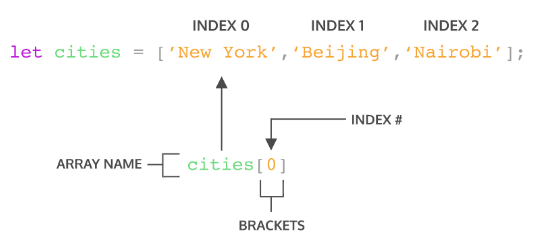

# Writing Week 3
## JS Intermediate - Array
Array adalah tipe data list order yang dapat menyimpan tipe data apapun di dalamnya. Array dapat menyimpan tipe data String, Number, Boolean, dan lainnya.

- ## Contoh Array
    ```bash
    // Product Team
    // 1. Product Manager
    // 2. Front End Developer
    // 3. Back End Developer
    let productTeam = ['Product Manager','Front End Developer', 'Back End Developer'];
    console.log(productTeam);

    // To do list
    // 1. Belajar javascript
    // 2. Mencuci baju
    // 3. Latihan membuat aplikasi javascript
    let toDoList = [
        'Belajar javascript',
        'Mencuci baju',
        'Latihan membuat aplikasi javascript'
    ];
    console.log(toDoList);
    
    // Menyimpan banyak tipe data
    // String, Number, dan Boolean
    let randomData = ['Ini string', 20, true]
    console.log(randomData);
    ```

- ## Membuat Array
    Array didefinisikan menggunakan square brackets
    // Square Bracket
    []

- ## Mengakses/Memanggil Array
    Array pada javascript dihitung dari index data ke-0.

    Data pertama adalah index ke-0.

    

- ## Update Array
    Seperti tipe data dan variabel pada umumnya, kita dapat mengupdate data pada Array.

    ```bash
    let productTeam = ['Product Manager', 'Front End Developer', 'Back End Developer'];

    ProductTeam[0] = 'Product Designer';
    console.log(productTeam);
    // Output: ['Product Designer', 'Front End Developer', 'Back End Developer'];
    ```

- ## Const in Array
    - Jika menggunakan let, kita dapat mengubah array dengan array baru dan konten nilai yang ada di dalam array dengan nilai lain.
    - Const tidak bisa melakukan update data. Namun pada Array kita dapat melakukan update konten nilai di dalam array(mutable).
    - Yang tidak bisa adalah mengubah array dengan array yang baru jika menggunakan const.
    
    ```bash
    const cars = ['tesla', 'honda', 'toyota'];
    cars[2] = ['nissan'];
    console.log(cars);
    // Output: ['tesla', 'honda', 'nissan']
    ```

- ## Array Properties
    Array memiliki 5 properti yang sering digunakan yaitu **Constructor, length, index, input, dan prototype.** 

    Properti adalah fitur yang sudah disediakan oleh javascript untuk memudahkan developer.

- ## Array Method
    **Array** memiliki **method** atau biasa disebut **built-in methods.** Artinya Javascript sudah memudahkan kita dengan menyediakan function/method umum yang bisa kita gunakan.

    - Contoh Array Built-in Methods
        - .push() adalah method untuk menambahkan item array pada urutan yang paling akhir.
        - .pop() adalah method yang menghapus item array index terakhir.
        - .shift() adalah method untuk menghapus item Array pada index pertama.
        - .unsift() adalah method untuk menambahkan item Array pada index pertama.
        - .sort() adalah method untuk mengurutkan secara Ascending atau Descending Alphanumeric.

- ## Looping pada Array
    Array memiliki built in methods untuk melakukan **looping** yaitu **.map()** dan **.forEach()**

    - .forEach() adalah method untuk melakukan looping pada setiap elemen array.
    ```bash
    const cars = ['tesla', 'honda', 'toyota'];
    cars.forEach(element => {
        console.log(element);
    });
    // Output: 'tesla', 'honda', 'nissan'
    ```
    - .map() melakukan perulangan/looping dengan membuat array baru.
    ```bash
    let arr = [1, 2, 3, 4, 5];

    let doubled = arr.map(num => {
        return num * 2;
    });

    console.log(doubled);
    // Output: [2, 4, 6, 8, 10]
    ```

    .map() dan forEach() sama-sama melakukan looping dan mengembalikan nilai baru dari operasi yang dilakukan. Perbedaannya adalah .forEach tidak dapat membuat Array baru dari hasil operasi yang ada dalam looping.

    Jadi, gunakan .forEach() jika hanya memerlukan looping untuk menampilkan saja atau menyimpan ke database. Gunakan .map() jika akan melakukan operasi pada array seperti yang dapat mengubah nilai array sebelumnya.

## JS Intermediate - Multidimensional Array
Multidimensional Array bisa dianalogikan dengan array of array.

Ada array didalam array.

```bash
let inventory = [
    ['Kaos Polos', 10],
    ['Jaket Hoodie', 12],
    ['Topi', 24],
    ['Celana Jeans', 8],
];

console.log(inventory);
```
## JS Intermediate - Object
Pada programming, object adalah sebuah tipe data pada variabel yang menyimpan properti dan fungsi (method).

**Properti** adalah data lengkap dari sebuah object. **Method** adalah action dari sebuah object. Apa saja yang dapat dilakukan dari suatu object.

- ## Membuat sebuah object
    Sama seperti tipe data sebelumnya. Object dapat diassign ke dalam sebuah variabel.
    ```bash
    let person = {}; // person is an empty object

    let person = {
        name: 'John Doe',
        age: 25,
        isVerified: true,
    }
    ```
    Sama seperti array, di dalam object kita dapat menyimpan peoperti dengan tipe data apapun.

- ## Mengakses Object dan Property Object
    ```bash
    let person = {}; // person is an empty object

    let person = {
        name: 'John Doe',
        age: 25,
        isVerified: true,
    }

    // panggil nama variabel untuk access object
    console.log(person);
    ```

- ## Update Object
    Kita dapat melakukan update pada variabel dengan tipe data Object.

    Do's
    - Object dapat mengupdate value dari key yang sudah tersedia.
    - Object dapat menambahkan key dan value baru.
    ```bash
    let people = {
        name: 'John Doe',
        age: 25,
        isVerified: true,
    }

    // Update current key with the new value
    people.age = 27;

    // Add new key and value
    people.address = 'Cambridge, UK';

    console.log(people);
    // Output
    // {
    //  name: 'John Doe',
    //  age: 25,
    //  isVerified: true,
    // }
    ```

    Dont's
    - Jika menggunakan constant pada variable object. Kita tidak bisa mengganti seluruh data object dengan object yang baru.
    ```bash
    const people = {
        name: 'John Doe',
        age: 25,
        isVerified: true,
    }

    people = {
        fullname: 'John Doe'
    }

    console.log(people); // Uncaught TypeError: Assignment to constant variable.
    ```

    Jadi jika membutuhkan untuk update seluruh data object gunakan ‘let’ pada saat deklarasi variabel.
    ```bash
    let people = {
        name: 'John Doe',
        age: 25,
        isVerified: true,
    }

    people = {
        fullname: 'John Doe'
    }

    console.log(people);
    // Output
    // {
    //  fullname: 'John Doe',
    // }
    ```
- ## Delete Object Property
    Kita dapat menghapus properti dari object menggunakan delete operator.
    ```bash
    let people = {
        name: 'John Doe',
        age: 25,
        isVerified: true,
    }

    delete people.age;

    console.log(people);
    // Output
    // {
    //  name: 'John Doe',
    //  isVerified: true,
    // },
    ```
## JS Intermediate - Recursive
Recursive adalah function yang memanggil dirinya sendiri sampai kondisi tertentu.

Recursive kebanyakan digunakan untuk case matematika, fisika, kimia, dan yang berhubungan dengan calculation.

```bash
function recursive() {
    // ...
    recursive();
    // ...
}

function recursive() {
    if(condition) {
        // stop calling itself
        // ...
    } else {
        recursive();
    }
}
```

- ## Ciri dari rekursif
    - Fungsi rekursif selalu memiliki kondisi yang menyatakan kapan fungsi tersebut berhenti. Kondisi ini harus dapat dibuktikan akan tercapai, karena jika tidak tercapai maka kita tidak dapat membuktikan bahwa fungsi akan berhenti, yang berarti algoritma kita tidak benar.
    - Fungsi rekursif selalu memanggil dirinya sendiri sambil mengurangi atau memecahkan data masukan setiap panggilannya. Hal ini penting diingat, karena tujuan utama dari rekursif ialah memecahkan masalah dengan mengurangi masalah tersebut menjadi masalah-masalah kecil.

## JS Intermediate - Asynchronous - Introduction
Asynchronous programming adalah teknik yang memungkinkan program untuk memulai task yang berpotensi akan berjalan dengan lama dan masih dapat responsif terhadap peristiwa lain saat task itu berjalan, daripada harus menunggu sampai task itu selesai. Setelah task itu selesai, program akan ditampilkan dengan hasilnya.

Banyak fungsi yang disediakan oleh browser, terutama yang paling menarik, berpotensi memakan waktu lama, dan karena itu, tidak sinkron. Sebagai contoh:
- Membuat permintaan HTTP menggunakan ```fetch().```
- Mengakses kamera atau microphone user menggunakan ```getUserMedia().```
- Meminta user untuk memilih file menggunakan ```showOpenFilePicker().```

## JS Intermediate - Asynchronous - Promise
Promise sendiri adalah salah satu fitur dari ES6 (ES2015) JavaScript. Konsep promise hadir untuk memecahkan masalah yang bertele-tele dengan callback, semakin banyak kita menggunakan callback untuk proses asynchronous semakin kompleks dan sulit kode kita untuk dibaca dan dipelihara. Kita juga akan sering menghadapi callback di dalam callback dan seterusnya. Masalah seperti ini disebut dengan Callback Hell.

**Promise** sesuai dengan artinya adalah janji. Seperti ketika kita berjanji, jika apa yang kita janjikan bisa kita lakukan maka kita harus melakukannya, jika janjinya ada halangan maka kita tidak bisa melakukannya atau jika janji tersebut belum pada waktunya kita juga harus menunggunya.

- ## 3 Status Promise di JavaScript
    Analogi dari sebuah promise di JavaScript itu sama seperti kita saat mengambil suatu data baik itu dari database maupun Request API. Akan ada 3 kondisi yaitu data sedang diproses, data berhasil didapatkan, atau data gagal didapatkan.

    Pada promise analogi di atas bisa diartikan seperti:
    - **pending**, jika data sedang diproses.
    - **fulfilled**, jika data telah berhasil didapatkan.
    - **rejected**, jika data gagal didapatkan.

- ## Contoh penggunaan promise
    ```bash
    let newPromise = new Promise((resolve, reject) => {
    if (true) {
        // apa yang dilakukan jika promise fulfilled
        resolve("Berhasil");
    } else {
        // apa yang dilakukan jika promise rejected
        reject("Gagal");
    }
    });
    ```

## JS Intermediate - Web Storage
Ada beberapa cara untuk menyimpan data pengguna seperti pencarian, artikel berita, dan lain-lain ke lokal (browser) menggunakan web storage seperti cookies, local storage, dan session storage. Data ini dimanfaatkan oleh situs web tersebut untuk merekam kebiasaan pengguna agar dapat memberikan rekomendasi sesuai preferensi si pengguna tersebut.

**Cookies** adalah data kecil yang dikirim dari situs web dan disimpan di komputer kita oleh web browser saat kita menjelajah. Disebut data kecil karena maksimum data yang dapat disimpan dalam cookies adalah 4096 bytes (4 KB).

- Local Storage dan Session Storage
    Dengan memanfaatkan local storage dan session storage, kita dapat menyimpan data lebih besar yaitu 5MB per page tanpa mempengaruhi kinerja situs web. Namun, penting untuk diketahui agar kita tidak menyimpan data sensitif seperti password ke dalam local storage ataupun session storage untuk menghindari serangan pencurian data.