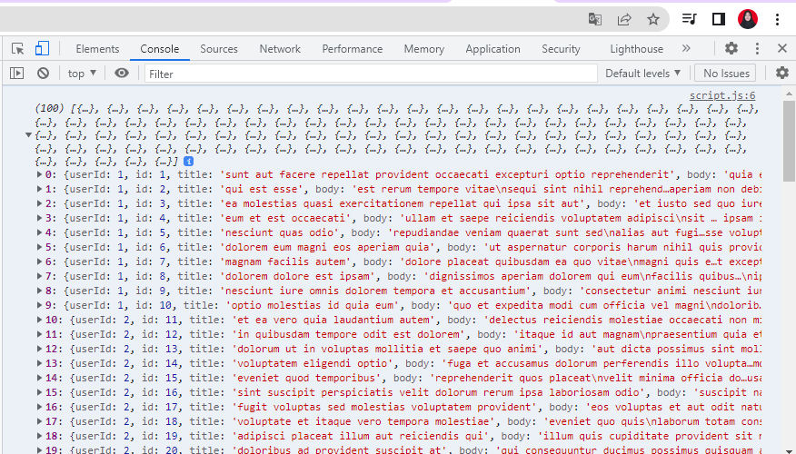
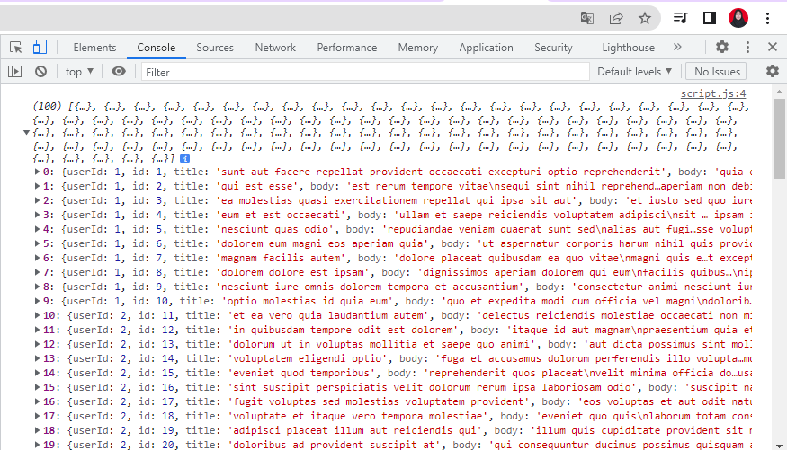
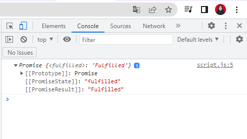
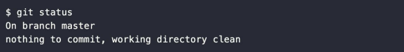

# Writing Week 4
## JavaScript Intermediate - Fetch 
Dalam JavaScript kita bisa mengirimkan _network request_ dan juga bisa mengambil informasi data terbaru dari server jika dibutuhkan.

Contoh _network request_ yang biasa kita lakukan:
- Mengirimkan data dari sebuah form
- Mengambil data untuk ditampilkan dalam list/table
- Mendapatkan notifikasi
Dalam melakukan _network request_, JavaScript memiliki metode bernama ``fetch()``.

Proses melakukan ``fetch()`` adalah salah satu proses _asynchronous_ di JavaScript sehingga kita perlu menggunakan salah satu diantara promise atau async/await.

- ## Fetch dengan Promise
    Berikut contoh _request_ data dengan ``fetch() `` menggunakan promise:
    ```bash
    fetch("https://jsonplaceholder.typicode.com/posts")
        .then(function (response) {
            return response.json();
        })
        .then(function (post) {
            console.log(post);
        });
    ```

    

- ## Fetch dengan async/await
    Berikut contoh _request_ data dengan ``fetch()`` menggunakan ``async/await``:
    ```bash
    const tesFetchAsync = async () => {
        let response = await fetch("https://jsonplaceholder.typicode.com/posts");
        response =  await response.json();
        console.log(response);
    };
    tesFetchAsync();
    ```

    

    Dalam penggunaan di dunia kerja dan aplikasi berskala besar kita bisa memilih menggunakan promise ataupun async/await tetapi kita lihat jika menggunakan async/await, kode kita terlihat lebih clean.

## JavaScript Intermediate - Async Await
Selain menggunakan callback dan promise, kita juga bisa menggunakan async/await untuk menggunakan asynchronous pada JavaScript. Async/await baru ada ketika update ES8 JavaScript dan dibangun menggunakan promise. Jadi sebenarnya async/await dan promise itu sama saja, namun hanya berbeda dari syntax dan cara penggunaannya.

Ada 2 kata kunci yang memiliki pengertian sebagai berikut:
- ``async``, mengubah _function synchronous_ menjadi asynchronous.
- ``await``, menunda eksekusi hingga proses _asynchronous_ selesai.

Sebuah async function bisa tidak berisi await sama sekali atau lebih dari satu await. Keyword await hanya bisa digunakan didalam async function, jika digunakan di luar async function maka akan terjadi error.

- ## Async
Berikut ini contoh penggunaan dari ``async``:
```bash
// async menggunakan keyword function 
async function tesAsyncAwait() {
  return "Fulfilled";
}

console.log(tesAsyncAwait());
// async menggunakan arrow function
const tesAsyncAwait = async () => {
  return "Fulfilled";
};

console.log(tesAsyncAwait());
```

Jika salah satu kode di atas dijalankan, maka akan terlihat tampilan seperti berikut ini:



- ## Await
## Git & Github Lanjutan
GIT adalah aplikasi yang dapat melacak setiap perubahan yang terjadi pada suatu folder atau file. Git biasanya digunakan oleh para programmer sebagai tempat penyimpanan file pemrograman mereka, karena lebih efektif. File-file yang disimpan menggunakan git akan terlacak seluruh perubahannya, termasuk siapa yang mengubah.

Dengan menggunakan GIT dan Github, kita akan bisa bekerja dalam sebuah tim yaitu dapat **berkolaborasi** mengerjakan proyek yang sama tanpa harus copy paste folder aplikasi yang terupdate.

- ## GIT STATUS
    3 Kondisi File pada GIT:
    - Modified
        Modified adalah kondisi dimana revisi atau perubahan sudah dilakukan, tetapi belum ditandai (untracked) dan belum disimpan dalam version control.
    - Staged
        Staged adalah kondisi dimana revisi sudah ditandai (modified) namun belum disimpan di version control.
    - Committed
        Commit/committed adalah kondisi dimana revisi sudah disimpan pada version control.
- ## GIT ADD
    Setelah mengecek status dengan 'git status', selanjutnya kita ubah status 'untrackted file' dan 'unmodified' menjadi modified. Gunakan ``'git add .'``
- ## GIT COMMIT
    Melakukan 'git commit' untuk save perubahan pada version control. ``'git commit -m "commit"'``
- ## GIT CHECKOUT, GIT RESET, GIT REVERT
    Jika perubahan yang sedang dilakukan terjadi kesalahan dan kita ingin mengembalikan keadaan seperti sebelumnya itu bisa dilakukan. Bisa menggunkan ``'git diff'``
     - Membatalkan perubahan. Belum stagged dan belum commited.
     Jika casenya seperti judul di atas maka bisa dilakukan dengan perintah berikut ini: ``'git checkout'``.
     Maka akan menjadi:

     
     
- ## GIT BRANCH
    Fitur yang wajib digunakan jika berkolaborasi dengan developer atau dalam tim. Git branch untuk menghindari conflict code yang dikembangkan dan kita tidak boleh berkolaborasi dalam project di satu branch yang sama.

    Untuk membuat branch, menggunakan perintah berikut ini:
    ``git branch <branch>``
    Contoh kita ingin membuat fitur login, jadi kita akan membuat branch baru:
    ``git branch fitur_login``
    Untuk menghapus sebuah branch, gunakan perintah berikut:
    ``git branch -d <branch>``
    ex kita ingin menghapus branch login: ``git branch -d fitur_login``

- ## GIT MERGE
    Setelah membuat branch baru, lalu lakukan commit. Kemudian kita menyatukan pekerjaan ke master file/branch utama yaitu branch MASTER.

    Untuk menyatukan branch cabang fitur yang telah kita kembangkan. Gunakan perintah berikut ini:
    1. Checkout ke branch master
        ``git checkout master``
    2. Lalu lakukan merge
        ``git merge fitur_login``

## Responsive Web Design
Responsive Web Design (RWD) adalah bertujuan membuat design website dapat diakses dalam device apapun.

Dalam membuat aplikasi kita harus memikirkan user akan menggunakannya. Device yang umumnya digunakan adalah laptop/PC, smartphone, dan tablet.

- ## Add Viewport in HTML
    ``<meta name="viewport" content="width-device-width, initial-scale=1.0">``

    ```bash
    <!DOCTYPE html>
    <html lang="en">
    <head>
        <meta charset="UTF-8">
        <meta http-equiv="X-UA-Compatible" content="IE=edge">
        <meta name="viewport" content="width=device-width, initial-scale=1.0">
        <title>Document</title>
    </head>
    <body>
        
    </body>
    </html>
    ```

- ## Use Max-width element
    ````

- ## Media Query
    Jenis media query:
    - Media query untuk responsive web design umumnya hanya menggunakan 2 jenis media query.
    - Keduanya yaitu min-width dan max-width

    ```bash
    @media screen and (min-width: your pixel) {
        /* your tag element html and your css */
    }

    @media screen and (max-width: your pixel) {
        /* your tag element html and your css */
    }
    ```

    Media query digunakan untuk membuat beberapa styles tergantung pada jenis device.

    Ada 2 cara/pattern dalam menggunakan media query:
    1. Membuat file css berbeda untuk masing-masing device
    2. Menggabungkan 1 file css untuk setting styling berbagai device

- ## Breakpoint
    Perubahan yang terjadi pada tampilan saat berganti device atau ukuran width disebut **breakpoint**.

- ## Complex Breakpoint Media Query
    Jika kita menginginkan tampilan yang ingin diterapkan pada range ukuran device tertentu, kita bisa membuatnya menjadi **range media query**.

    ```bash
    body {
        background-color: white;
    }

    /* Styling ini akan dijalankan jika width pada device lebih atau sama dengan 500px dan max 700px */
    /* Styling ini tidak akan dijalankan jika width lebih dari 700px */
    @media screen and (min-width: 500px) and (max-width: 700px) {
        body {
            background-color: aquamarine;
        }
    }
    ```

## Bootstrap 5
Bootstrap adalah framework HTML, CSS, dan JavaScript yang berfungsi  untuk mendesain website _responsive_ dengan cepat dan mudah.

Framework open source ini diciptakan pada tahun 2011 oleh Mark Otto dan Jacob Thornton dari Twitter. Itulah kenapa dulunya Bootstrap dinamakan Twitter Blueprint. 

Kemudahan yang ditawarkan oleh Bootstrap adalah kita tak perlu coding komponen website dari nol. Framework ini tersusun dari kumpulan file CSS dan JavaScript berbentuk class yang tinggal pakai. 

Class yang disediakan Bootstrap juga cukup lengkap. Mulai dari class untuk layout halaman, class menu navigasi, class animasi, dan masih banyak lainnya. 

Menariknya lagi, Bootstrap bersifat responsive berkat grid system yang digunakan. Sistem grid pada bootstrap menggunakan rangkaian containers, baris, dan kolom untuk menyesuaikan bentuk layout dan konten website kita.

- ## Cara menggunakan bootstrap
    Ada beberapa cara untuk menggunakan bootstrap:
    1. Bisa dengan mengcompiled CSS dan JS 
    2. Bisa juga dengan cara mendownload source filenya terus nanti dipasang di directory web kita
    3. Dan cara yang paling gampang yaitu dengan CDN. Kita tinggal copy paste
    4. Dan ada juga cara dengan npm